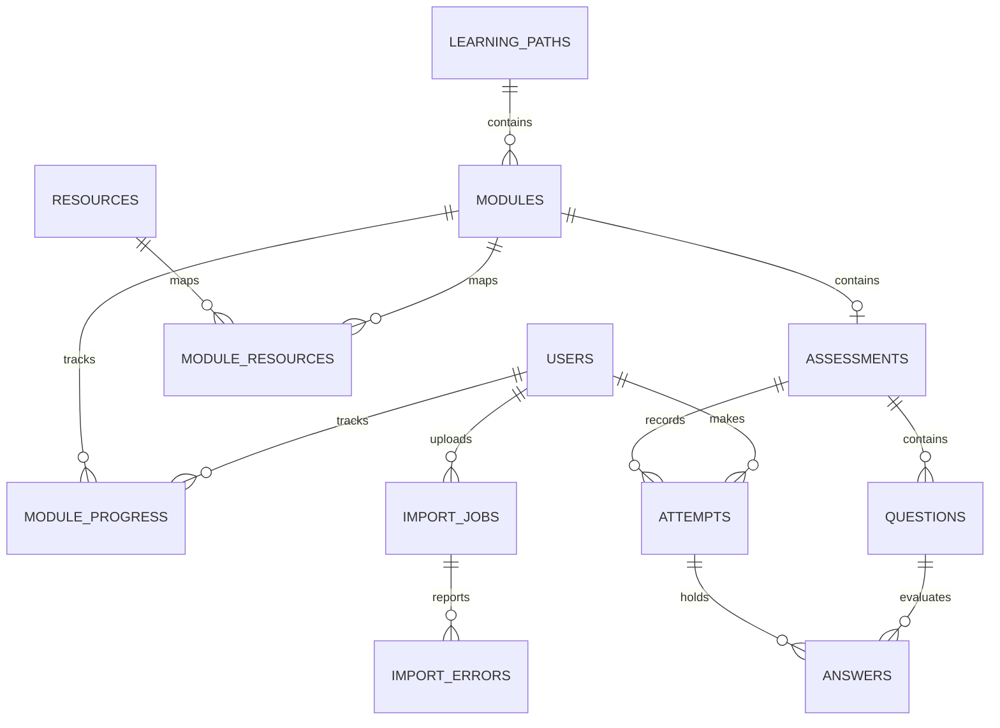
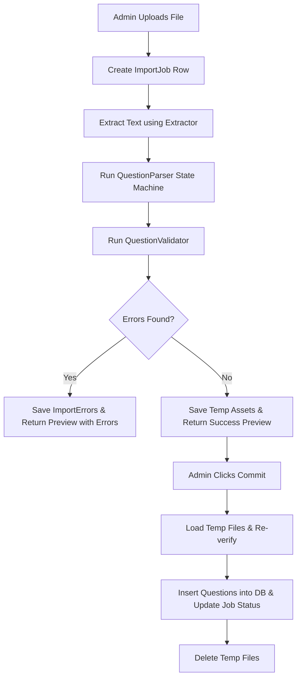

# ATR Foundation Architecture Documentation
This document serves as the single source of truth for the **ATR Foundation** platform architecture, design system, coding standards, and implementation rules. Read this document before proposing or executing any feature additions or modifications.

---

## 1. Project Overview

### Purpose
**ATR Foundation** is an internal onboarding and competency management platform built specifically for **ATR Design Studio**. The system standardizes employee training across landscaping, technical drawing standards, grading protocols, and botanical workflows.

### Scope Boundaries
- **Productivity Tool**: This is a targeted workflow enablement tool, not an enterprise Learning Management System (LMS) or Human Resources Management System (HRMS).
- **Core Goal**: Reduce repetitive manual coaching hours and ensure new hires achieve verified understanding of ATR standards.
- **AI Exclusions**: Artificial Intelligence features, conversational chatbots, and open-ended research modules are strictly out of scope for Version 1.

---

## 2. Tech Stack

| Layer | Technology | Purpose / Rationale |
| :--- | :--- | :--- |
| **Frontend** | React 19 | Component-based, responsive UI rendering |
| | TypeScript | Code safety and type checking |
| | Vite | Fast builds and hot module replacement |
| | TailwindCSS | Style management |
| | shadcn/ui | Premium, low-overhead UI primitives |
| | React Router | Client-side page routing |
| | TanStack Query | Server state caching and async queries |
| | React Hook Form | Dynamic forms state tracking |
| | Zod | Runtime client-side schema validation |
| **Backend** | FastAPI | Async routing, documentation autogeneration (Swagger/OpenAPI) |
| | SQLAlchemy 2.0 | Type-safe declarative database ORM mapper |
| | Alembic | Version-controlled schema migrations |
| | Pydantic v2 | Data serialization and request body validation |
| **Database** | PostgreSQL | Relational storage, indexing, and JSONB document support |
| **Auth** | Google OAuth & JWT | Google Identity Provider integration for single-sign-on (SSO) |
| **Hosting** | Vercel (Frontend) | Edge-optimized content delivery |
| | Render (Backend) | Containerized service host |
| | Render PostgreSQL | High availability managed database |

---

## 3. Architecture Style: Modular Monolith

The backend is structured as a **Modular Monolith**. Rather than separating code by technical layers (e.g. putting all routers in one place and all models in another), code is isolated by **domain boundaries**. Each domain folder acts as a self-contained unit containing its own routes, schemas, models, repositories, and services.

```
backend/app/
├── auth/            # OAuth token exchanges and JWT assertions
├── users/           # User profiles, active roles, repositories, services
├── modules/         # Paths, modules, progress tracking, repositories, services
├── resources/       # Standard libraries and reference catalogs, repositories
├── assessments/     # Quizzes, questions, attempts, answers, repositories
├── analytics/       # Completion rates, progress statistics, services
├── quiz_import/     # Document ingestion engine (TXT, MD, DOCX, PDF), repositories
├── common/          # Global configs, constants, enums, pagination, and BaseRepository
└── database/        # Session engine and model registration
```

### Module Responsibilities

#### `auth`
Responsible for processing Google ID tokens, asserting user presence in the system, and returning signed JWT access tokens. Contains no business logic for other subdomains.

#### `users`
Manages core employee profiles. Translates OAuth identifiers into internal database entities. Exposes role information (`Admin` vs `Employee`).

#### `modules`
Coordinates learning curricula. Groups instructional sequences into hierarchical **Learning Paths** containing ordered **Modules**. Manages the completion tracking state.

#### `resources`
Houses standard documents (such as AutoCAD detail blocks, planting palettes, and grading cheat-sheets). Resources are stored independently and can be linked to multiple modules.

#### `assessments`
Tracks the competency testing framework. Modules link to exactly one **Assessment** containing multiple-choice **Questions**. Records attempt history and score summaries.

#### `analytics`
Extracts cohort performance reports. Aggregates data from module progress and assessment records to output compliance matrices for administrators.

#### `quiz_import`
Ingests plain text, Markdown, PDF, and DOCX documents containing questions, parses their contents, performs validation checks, and imports them into assessments.

#### `common`
Contains global application configurations (Pydantic Settings) and custom base exceptions (such as `EntityNotFoundException` and `PermissionDeniedException`).

#### `database`
Initializes the SQLAlchemy async engine, sets up the connection pool, defines the `Base` declarative mapping class, and exposes session dependencies.

---

## 4. Current Database Schema

The database uses **UUID primary keys** and **PostgreSQL JSONB** columns for flexible document-style rows. Timezones are stored with UTC offsets.

### Database ER Diagram


### Table Definitions

#### `users`
Represents employees and administrators.
- `id` (UUID, PK)
- `google_id` (VARCHAR, Nullable, Index) - OAuth user match
- `email` (VARCHAR, Unique, Index)
- `full_name` (VARCHAR)
- `profile_picture` (VARCHAR, Nullable)
- `role` (VARCHAR) - `Admin` or `Employee`
- `is_active` (BOOLEAN) - Soft-disable accounts
- `created_at` (TIMESTAMP with Timezone)
- `updated_at` (TIMESTAMP with Timezone)

#### `learning_paths`
High-level curriculum containers.
- `id` (UUID, PK)
- `title` (VARCHAR)
- `description` (VARCHAR, Nullable)
- `is_active` (BOOLEAN)
- `created_at` (TIMESTAMP with Timezone)

#### `modules`
Specific learning topics.
- `id` (UUID, PK)
- `learning_path_id` (UUID, FK -> `learning_paths.id`)
- `title` (VARCHAR)
- `description` (VARCHAR, Nullable)
- `estimated_duration_minutes` (INTEGER)
- `passing_percentage` (INTEGER)
- `display_order` (INTEGER) - Position inside the path
- `created_at` (TIMESTAMP with Timezone)

#### `resources`
Reference assets linked to modules.
- `id` (UUID, PK)
- `title` (VARCHAR)
- `description` (VARCHAR, Nullable)
- `resource_type` (VARCHAR) - `pdf`, `dwg`, `video`, `link`
- `resource_url` (VARCHAR, Nullable)
- `uploaded_file_path` (VARCHAR, Nullable)
- `created_at` (TIMESTAMP with Timezone)

#### `module_resources`
Many-to-many junction table resolving reference mappings.
- `module_id` (UUID, FK -> `modules.id`, Joint PK)
- `resource_id` (UUID, FK -> `resources.id`, Joint PK)
- `display_order` (INTEGER)

#### `assessments`
Competency checks tied directly to learning modules.
- `id` (UUID, PK)
- `module_id` (UUID, FK -> `modules.id`, Unique) - 1-to-1 relationship
- `title` (VARCHAR)
- `passing_marks` (INTEGER)
- `max_attempts` (INTEGER)
- `created_at` (TIMESTAMP with Timezone)

#### `questions`
Evaluation questions inside an assessment.
- `id` (UUID, PK)
- `assessment_id` (UUID, FK -> `assessments.id`)
- `question` (VARCHAR)
- `options` (JSONB) - List of option strings: `["Opt A", "Opt B", "Opt C"]`
- `answer` (JSONB) - List of correct indices: `[0]` or `[0, 2]`
- `question_type` (VARCHAR) - `single_choice` or `multiple_choice`
- `topic` (VARCHAR, Nullable)
- `difficulty` (VARCHAR, Nullable)
- `marks` (INTEGER)
- `explanation` (VARCHAR, Nullable)
- `display_order` (INTEGER)
- `created_at` (TIMESTAMP with Timezone)

#### `module_progress`
Maintains user module completions.
- `id` (UUID, PK)
- `user_id` (UUID, FK -> `users.id`)
- `module_id` (UUID, FK -> `modules.id`)
- `progress_percentage` (INTEGER) - Range 0-100
- `status` (VARCHAR) - `not_started`, `in_progress`, `completed`
- `started_at` (TIMESTAMP with Timezone)
- `completed_at` (TIMESTAMP with Timezone, Nullable)

#### `attempts`
History of assessment attempts.
- `id` (UUID, PK)
- `assessment_id` (UUID, FK -> `assessments.id`)
- `user_id` (UUID, FK -> `users.id`)
- `attempt_number` (INTEGER)
- `score` (INTEGER) - Total points achieved
- `percentage` (FLOAT) - Calculated accuracy
- `started_at` (TIMESTAMP with Timezone)
- `submitted_at` (TIMESTAMP with Timezone, Nullable)

#### `answers`
Specific answers chosen by a user in an assessment attempt.
- `id` (UUID, PK)
- `attempt_id` (UUID, FK -> `attempts.id`)
- `question_id` (UUID, FK -> `questions.id`)
- `selected_answer` (JSONB) - List of selected indices: `[1]`
- `awarded_marks` (INTEGER)

#### `import_jobs`
Status of administrative quiz document imports.
- `id` (UUID, PK)
- `filename` (VARCHAR)
- `uploaded_by` (UUID, FK -> `users.id`, Nullable)
- `status` (VARCHAR) - `pending`, `processing`, `completed`, `failed`
- `uploaded_at` (TIMESTAMP with Timezone)
- `completed_at` (TIMESTAMP with Timezone, Nullable)

#### `import_errors`
Parsing errors recorded during an import job run.
- `id` (UUID, PK)
- `import_job_id` (UUID, FK -> `import_jobs.id`)
- `error_message` (VARCHAR)
- `line_number` (INTEGER, Nullable)

---

## 5. Quiz Import Engine

Administrators can write and upload quiz documents to populate assessments. 

### Document Structure Specification
Every question block in uploaded documents must match this syntax:
```
Question:
[Question Text]

Options:
A. [Option 1 text]
B. [Option 2 text]
...

Answer:
[Correct option letter(s), comma-separated]

Topic:
[Domain topic]

Difficulty:
[Easy/Medium/Hard]

Marks:
[Integer value]

Explanation:
[Reference notes]
```

### Ingestion Workflow


### Component Breakdown

#### Extractors (`app/quiz_import/extractors/`)
Decodes binary data into raw string streams.
- **`DocxExtractor`**: Utilizes `python-docx` to load XML document zip files and read paragraph paragraphs.
- **`PdfExtractor`**: Utilizes `pdfplumber` to extract layout text page by page.
- **`TxtExtractor` & `MarkdownExtractor`**: Performs UTF-8 decoding on plain text formats.

#### Parser (`app/quiz_import/parsers/`)
- **`QuestionParser`**: A line-by-line state machine parser. Automatically transitions between section states, cleans up standard options markers (like `A.`, `B)`, `A -`), and converts character answer symbols to option index offsets (e.g. `"A, C"` -> `[0, 2]`). Tracks the precise line number of each question to log validation errors.

#### Validator (`app/quiz_import/validators/`)
- **`QuestionValidator`**: Evaluates individual question integrity rules:
  - Asserts question string exists and contains characters.
  - Verifies at least 2 options are present.
  - Asserts correct answer matches an option index range.
  - Asserts presence of topic and difficulty details.
  - Verifies marks are formatted as valid integers.
  - Appends validation issues into an aggregated collection instead of halting execution immediately.

#### Import Service (`app/quiz_import/services/`)
- **`QuizImportService`**: Coordinates data pipelines, writes temporary upload files to the `temp_files/` folder (using `job_id` naming keys), persists parsing errors to `ImportError` rows, handles incremental ordering calculations, and performs atomic database commits.

### JSONB Column Design Justification
- **No Separate `options` Table**: In V1, quiz questions are static assessments. Creating separate option rows creates unnecessary database joins, increases transaction latency, and complicates DB schemas.
- **PostgreSQL JSONB**: Storing option and correct answer arrays inside JSONB allows quick queries, simplifies model serialization, and ensures clean database reads.

---

## 6. Current Project Structure

```
ATR/
├── docker-compose.yml           # Database, API, and Client orchestration
├── package.json                 # Dev command aliases
├── requirements.txt             # Global python dependencies
├── ARCHITECTURE.md              # System Architecture (This file)
│
├── backend/                     # API Service Source Code
│   ├── alembic/                 # Migration scripts
│   ├── app/                     # Main backend code
│   │   ├── common/              # Settings, constants, enums, BaseRepository
│   │   ├── database/            # DB engine, model registration (base.py)
│   │   ├── auth/                # OAuth logic
│   │   ├── users/               # Profiles models, routes, repositories, services
│   │   ├── modules/             # Learning paths, modules, progress, repositories
│   │   ├── resources/           # Reference library models, repositories, services
│   │   ├── assessments/         # Quizzes, questions, attempts, repositories, services
│   │   ├── analytics/           # Status reporting, services, routes
│   │   └── quiz_import/         # Document import pipelines, repositories, services
│   ├── Dockerfile               # Build configuration
│   ├── requirements.txt         # Backend python packages
│   └── main.py                  # CLI Uvicorn entrypoint
│
└── frontend/                    # Single Page App Client
    ├── src/
    │   ├── assets/              # Logos and styles
    │   ├── components/
    │   │   └── ui/              # Tailwind v4 UI building blocks
    │   ├── contexts/            # Theme and Auth mock context hooks
    │   ├── hooks/               # LocalStorage state integrations
    │   ├── layouts/             # Route shells (MainLayout, AuthLayout)
    │   ├── pages/               # Route components
    │   ├── services/            # Base API client (api.ts)
    │   ├── types/               # TypeScript models interface bindings
    │   ├── utils/               # Classname merge helpers (cn.ts)
    │   ├── App.tsx              # Router paths mapping
    │   ├── index.css            # Base stylesheet layers and design tokens
    │   └── main.tsx             # DOM mounting setup
    ├── Dockerfile               # Client production build configurations
    ├── nginx.conf               # Nginx routing rules
    └── vite.config.ts           # Path alias configs
```

---

## 7. Design Principles

### Single Responsibility Principle (SRP)
Every class and module has a single reason to change. Extractors only parse file formats, Validators check business constraints, and Services perform database transactions.

### Separation of Concerns (SoC)
The code clearly separates persistence, database queries, business logic, serialization, and presentation.
- **SQLAlchemy Models**: Define database tables and relationships.
- **Repositories**: Execute database queries using SQLAlchemy. Inherit generic operations from `BaseRepository`.
- **Pydantic Schemas**: Control serialization and request validation.
- **Services**: Coordinate business logic, state mutations, and file operations.
- **API Routes**: Expose HTTP endpoints and handle exceptions.

### Modular Monolith Isolation
Modules must not import model objects from other modules. Shared logic is handled through IDs and domain service lookups to maintain clear service boundaries.

### Stateless Services
Backend services maintain no internal state between calls. In-progress imports are persisted as files on disk alongside database records to support stateless REST patterns.

### Dependency Injection
Dependencies are loosely coupled using constructor injection:
- **Routes** receive database sessions via FastAPI's `Depends(get_db)`.
- **Repositories** are instantiated with the injected `AsyncSession`.
- **Services** receive their required domain repositories, separating query construction from business logic.

---

## 8. Coding Standards

### 1. Route Layer Rules
- **No Database Access**: Never write SQL statements or instantiate database connections directly in routes.
- **Dependency Setup**: Instantiate domain repositories with the route's db session and inject them into the services.
- **No Business Logic**: Keep routes simple. Routes should only validate inputs, call a service class method, and return JSON responses.
- **Exception Handling**: Catch service exceptions and raise appropriate `HTTPException` codes.

### 2. Repository Layer Rules
- All domain repositories must subclass `BaseRepository`.
- Repositories are the sole location where SQLAlchemy queries are executed. No business logic or schema formatting should happen here.

### 3. Service Layer Rules
- Services perform all data mutations and logic checks.
- Service methods receive repository instances in their constructor. They must not perform raw database sessions operations directly.

### 3. Model & Schema Layer Rules
- Schema names must align with their domains (e.g. `UserRead`, `ModuleCreate`).
- Schemas must inherit from `BaseModel` and set `model_config = ConfigDict(from_attributes=True)` to map to SQLAlchemy models.
- All models must define database-level foreign key cascades (`ondelete="CASCADE"`).

---

## 9. UI Design Principles

ATR Foundation is built to resemble professional architectural and design software:
- **Colors**: Dominated by an earth-tone palette featuring soft sage greens, warm sand beiges, charcoal, and dark stone gray backdrops.
- **Typography**: Outfit font for display headings, paired with Plus Jakarta Sans for body layouts.
- **Whitespace**: Generous layout margins and high-contrast styling to look clean and premium.
- **Design Aesthetic**: Avoid typical corporate LMS designs. Use modern panels, progress bars, hover states, and micro-animations.

---

## 10. Future Development Rules

Before implementing any new features, engineers must follow these steps:
1. **Consult This Document**: Review model schemas, boundaries, and principles before starting.
2. **Respect Domain Boundaries**: Put code in the appropriate module folder. Do not create cross-module dependencies.
3. **No Direct Database Access in Routes**: Put all logic in the service layer.
4. **No AI Implementations**: V1 must not contain machine learning models, search indices, or AI summarizations.
5. **Always Generate Migrations**: All database alterations must have an Alembic migration script.

---

## 11. Project Decision Log

- [x] **Web Application**: Single Page App client (Vite + React) paired with an API service.
- [x] **React + FastAPI**: Chosen for high development velocity, type safety, and fast startup times.
- [x] **PostgreSQL**: Selected for ACID compliance, relational integrity, and JSONB document support.
- [x] **Google SSO & JWT**: Bypasses local password management in favor of Google OAuth.
- [x] **Modular Monolith**: Balances code readability with simple deployments.
- [x] **JSONB for Question Options**: Simplifies schemas and speeds up quiz questions retrieval.
- [x] **Preview Before Commit**: Saves server resources and prevents database pollution during document imports.
- [x] **Resource Library**: Standard references library separate from assessments.
- [x] **Learning Paths**: Structured courses progression support.
- [x] **No AI in Version 1**: Out of scope for current system launch.
